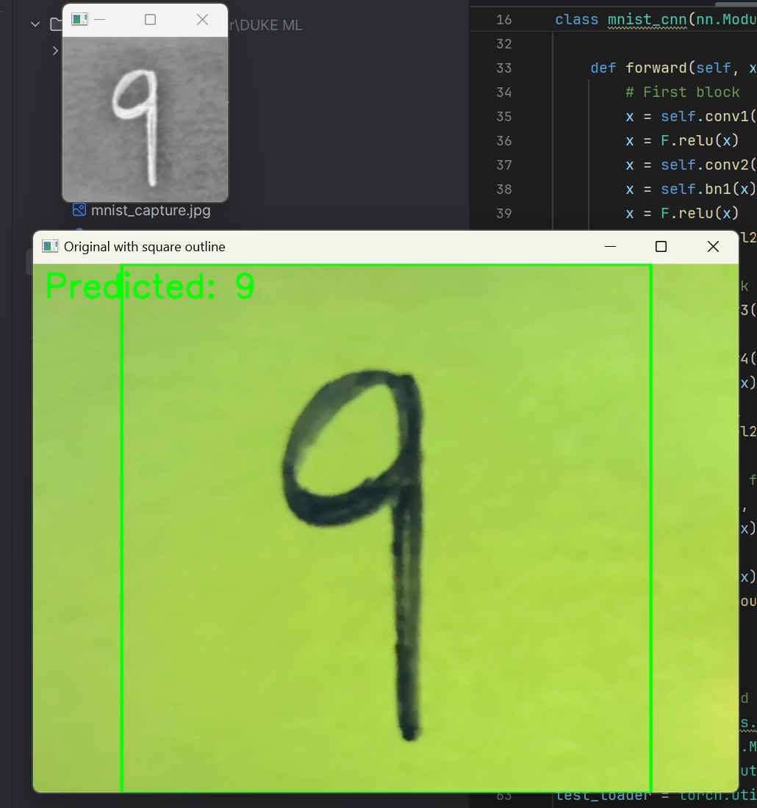

# MNIST Digit Classifier with PyTorch (and Arduino Display)

This project implements a Convolutional Neural Network (CNN) using PyTorch to classify handwritten digits from the MNIST dataset. The model achieves high accuracy after a few epochs, although playing around with dropout and epochs is recommended. Further it tests the model by indicating what numbers are predicted by the webcam, for this OpenCV was used.

### Arduino 7-Segment Display

You can make so the prediction is whows in a 7-segment display using an arduino. This serves just as a showcase that information from the model can be transmitted to an arduino program.

- To use the variant with the arduino, use the files in the Arduino folder.


## Instructions

- Let the program train the model, progress bars wil appear, and the accuracy will be shown.
- Two windows will appear, a big coloured one with a green square in which to centre the drawn digit. Another smaller window, will show the B&W image that the CNN sees.
- Press the 'q' key to take a screenshot of the B&W image.
- Press the 'e' key to exit the program.

## Features

- Two-layer CNN with ReLU activations and max pooling
- Trained on the MNIST dataset using the Adam optimizer
- Achieves ~98% test accuracy after 3 epochs, although 5-7 are recommended.
- Interactive visualization of random test predictions
- Automatically utilizes GPU if available

## Requirements

- Python 3.x
- PyTorch
- torchvision
- matplotlib
- tqdm
- opencv
- pyserial (for arduino)

Install dependencies with:

```bash
pip install torch torchvision matplotlib tqdm opencv pyserial
